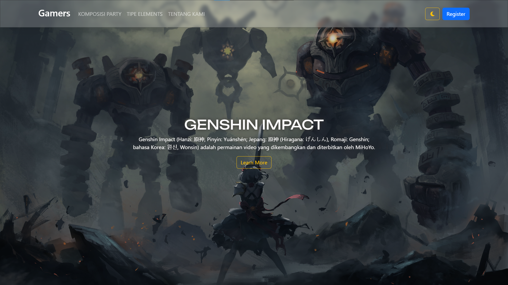

# 🎮 Gamers - Genshin Impact Web Showcase

A highly premium, interactive, and responsive web showcase for **Genshin Impact** built with modern web technologies. This landing page demonstrates advanced styling, glassmorphism, dynamic scrolling transitions, a fully-functional light/dark mode, and gorgeous 3D parallax hover animations.

✨ **Live Demo:** [Explore the Live Showcase](https://anggasaputra25.github.io/genshin)

---

## 📸 Preview Showcase

<p align="center">
  
</p>

---

## 🚀 Key Features

*   **🌙 Dynamic Light/Dark Mode:** Seamlessly toggle between an immersive, dark Teyvat-themed dark mode and a sleek light mode with smooth transitions.
*   **🔮 Glassmorphism Navigation:** A stunning floating navbar using CSS backdrop filters that smoothly shrinks and rounds into a compact floating bar (`.ns`) when the page is scrolled.
*   **💫 Smooth Animate-On-Scroll (AOS):** Beautiful fade, zoom, and flip scroll triggers powered by `AOS.js` to bring content to life dynamically.
*   **🎭 Interactive 3D Card Parallax:** A custom "About Me" profile card utilizing `Vanilla-Tilt.js` that reacts to 3D cursor movement with high-performance glare and tilt physics.
*   **🎠 Responsive Elements Carousel:** A custom-styled Bootstrap carousel featuring Genshin Impact elements with customizable descriptive overlays.
*   **📱 Fully Responsive Web Design:** Meticulously optimized for all screen sizes—from high-definition desktop monitors to mobile phones.

---

## 🛠️ Technology Stack

The project is built entirely on the frontend with lightweight, high-performance libraries:

*   **Core Languages:**
    *    - Semantic web structure.
    *    - Advanced layouts, transitions, custom keyframes, scrollbar hiding, and responsive media queries.
    *    - Dynamic scrolling logic, theme state handlers, and interactive controls.
*   **Libraries & Frameworks:**
    *    (v5.2.3) - Fluid grid container layout and responsive utilities.
    *   **AOS (Animate On Scroll):** Lightweight library for scroll-triggered elements animation.
    *   **Vanilla-Tilt.js:** A smooth 3D parallax hover effect library.
    *    - High-quality vector icons for navigation, dark mode, and social profiles.
*   **Fonts & Typography:**
    *   **Google Fonts:** Customized loading of premium typography featuring `Unbounded` (curved, futuristic style for headings) and `Rubik` (sleek, legible style for reading).

---

## 📂 Project Structure

```bash
genshin/
├── assets/                  # High-quality images for party setups, elements, and profiles
├── vanilla-tilt.min.js      # Locally served lightweight 3D tilt interaction script
├── index.html               # Main website markup, structure, and CDN bindings
├── style.css                # Custom stylesheets, animation keyframes, and theme variables
├── script.js                # Core JS logic for navbar morphing, dark mode, and tilt initialization
├── ss.png                   # High-resolution homepage screenshot
└── README.md                # Project documentation and showcase guide
```

---

## ⚙️ Quick Start & Local Setup

Getting a local copy up and running is incredibly simple:

1.  **Clone the Repository:**
    ```bash
    git clone https://github.com/anggasaputra25/genshin.git
    ```
2.  **Open the Project:**
    Open `index.html` directly in your favorite web browser, or serve it using the **Live Server** extension in Visual Studio Code for real-time changes.

---

## ✍️ Author & Credits

Designed and developed by **Angga Saputra** — a passionate Front End Developer and Student.

*   🌐 **Portfolio/Instagram:** [@angga.site](https://www.instagram.com/angga.site)
*   💻 **GitHub:** [@anggasaputra25](https://github.com/anggasaputra25)

*Website content, imagery, and assets belong to [COGNOSPHERE / HoYoverse](https://www.hoyoverse.com).*